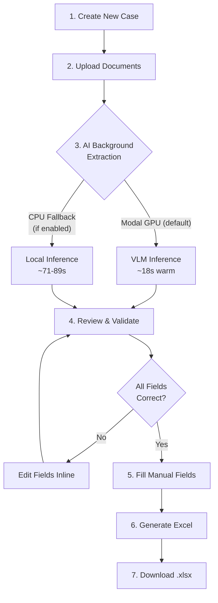

# Spec: Company Formation Workflow Automation — Workflow & UX

## 1. Executive Summary

**Goal**: Build a "Document-First" web tool that lets CA/CS firms upload PAN and Aadhaar images for company directors, extract KYC data with AI (Qwen3-VL-2B), validate it interactively, and auto-populate the standard *"Checklist for Company Formation"* Excel template.

**Current Status**: Core AI extraction pipeline validated on both Modal (T4 GPU) and local CPU. Excel template generator built.

---

## 2. Source Benchmarks (Validated)

### 2.1 Modal GPU (T4) — `modal_extract.py`

| Metric             | Value                       |
| ------------------ | --------------------------- |
| Model              | Qwen3-VL-2B-Instruct (fp16) |
| Cold start         | ~43s                        |
| Warm start (total) | ~18s                        |
| PAN inference      | 12.3s                       |
| Aadhaar inference  | 6.4s                        |
| Model load (GPU)   | 6.2s                        |
| Accuracy           | 6/6 fields ✅                |

**Source**: [Conversation `3243d03b`](file:///home/kmo7cob/.gemini/antigravity/brain/3243d03b-0090-4057-81f5-b2419101e2a2/walkthrough.md) — Ran `modal run modal_extract.py --pan pan.jpg --aadhaar aadhar.jpg --director 1`.

### 2.2 Approaches Tested & Discarded

| #     | Approach                       | Script             | Result                           |
| ----- | ------------------------------ | ------------------ | -------------------------------- |
| 1     | PaddleOCR-VL-1.5 on Modal T4   | `pan.py`           | ❌ 460s inference, garbage output |
| 2     | PaddleOCR v3.4 traditional OCR | `extract.py`       | ❌ Hung >5min on CPU              |
| 3     | Tesseract 5.3.4                | (inline)           | ❌ Fast (1s) but poor accuracy    |
| **4** | **Qwen3-VL-2B on Modal T4**    | `modal_extract.py` | **✅ 18s warm, 100% accuracy**    |

### 2.3 Local CPU — `test_qwen.py` (Benchmarked ✅)

| Metric            | Value                       |
| ----------------- | --------------------------- |
| Model             | Qwen3-VL-2B-Instruct (fp32) |
| Model load        | 2.8s                        |
| PAN inference     | 71.5s                       |
| Aadhaar inference | 89.2s                       |
| Total (2 docs)    | 160.8s                      |
| Accuracy          | 9/9 fields ✅                |

**Comparison to Modal T4**:

| Metric            | Modal T4 (fp16) | Local CPU (fp32) | Slowdown |
| ----------------- | --------------- | ---------------- | -------- |
| PAN inference     | 12.3s           | 71.5s            | 5.8×     |
| Aadhaar inference | 6.4s            | 89.2s            | 13.9×    |
| Total (2 docs)    | ~18s            | 160.8s           | 8.9×     |
| Accuracy          | 6/6 ✅           | 9/9 ✅            | Equal    |

---

## 3. Excel Checklist Mapping

The target template is `Checklist for Company Formation dated 11 02 2026.xlsx` (37 rows, 4 columns).

### 3.1 Template Structure

| Section | Rows  | Label                       |
| ------- | ----- | --------------------------- |
| **A**   | 4–22  | Information of Directors    |
| **B**   | 24–33 | Information of Company      |
| **C**   | 35–37 | Information of Professional |

Columns: `A` = S.No., `B` = Field Label, `C` = Director 1, `D` = Director 2.

### 3.2 Auto-Populated Fields (AI Extraction)

| Row | Field                       | Source  | Extraction Method                             |
| --- | --------------------------- | ------- | --------------------------------------------- |
| 4   | NAME as per PAN Card        | PAN     | VLM → `name`                                  |
| 5   | Father's Name               | PAN     | VLM → `fathers_name`                          |
| 6   | DOB (DD-MM-YYYY)            | PAN     | VLM → `date_of_birth`                         |
| 16  | PAN Number                  | PAN     | VLM → `pan_number`                            |
| 17  | Identity Proof (Aadhaar)    | Aadhaar | VLM → `aadhaar_number` (prefixed `AADHAR - `) |
| 18  | Residential Proof + Address | Aadhaar | VLM → `address`                               |

### 3.3 Manual-Entry Fields (User Fills via UI)

| Row | Field                          | Source                       |
| --- | ------------------------------ | ---------------------------- |
| 7   | Place of Birth                 | User input                   |
| 8   | Nationality                    | Default: Indian              |
| 9   | Resident of India              | Default: Yes                 |
| 10  | Occupation                     | User input                   |
| 11  | Educational Qualification      | User input                   |
| 12  | No. of Shares Subscribed       | User input                   |
| 13  | Duration of Stay at Address    | User input                   |
| 14  | Email ID                       | User input                   |
| 15  | Mobile No.                     | User input                   |
| 19  | DIN Number                     | User input                   |
| 20  | Director Photo (JPEG)          | File upload                  |
| 21  | Director Signature (PDF)       | File upload                  |
| 22  | Form DIR-2                     | File upload                  |
| 24  | Electricity Bill               | File upload                  |
| 25  | Latitude                       | User input                   |
| 26  | Longitude                      | User input                   |
| 27  | NOC from Landlord              | File upload                  |
| 28  | Office Email ID                | User input                   |
| 29  | Office Mob. No.                | User input                   |
| 30  | Total Authorized Share Capital | User input                   |
| 31  | Total Paid-up Share Capital    | User input                   |
| 32  | Objectives of the Company      | Template default / User edit |
| 33  | Other Objectives               | Template default / User edit |
| 35  | Name of CA/CS/Advocate         | User input                   |
| 36  | Membership No.                 | User input                   |
| 37  | Address (Professional)         | User input                   |

---

## 4. Workflow Specification

### 4.1 End-to-End Flow

### 4.2 Step-by-Step

| Step | Action                 | Actor  | Description                                                                                                                         |
| ---- | ---------------------- | ------ | ----------------------------------------------------------------------------------------------------------------------------------- |
| 1    | **Create Case**        | User   | Names the incorporation case (e.g., "ABC Pvt Ltd"). System creates a case folder.                                                   |
| 2    | **Upload Documents**   | User   | Drag-and-drop PAN + Aadhaar images per director (supports 2 directors). Photos, signatures, PDFs can also be uploaded.              |
| 3    | **AI Extraction**      | System | Identifies document type (PAN vs Aadhaar) automatically. Sends to Modal GPU for VLM inference. Shows progress spinner per document. |
| 4    | **Review & Validate**  | User   | Side-by-side view: original document image (with zoom/pan) alongside extracted data fields. User confirms or corrects each field.   |
| 5    | **Fill Manual Fields** | User   | Form for remaining fields not extractable by AI (occupation, shares, email, etc.). Smart defaults pre-filled where possible.        |
| 6    | **Generate Excel**     | System | Populates the Excel template maintaining strict formatting. Cross-validates PAN vs Aadhaar names.                                   |
| 7    | **Download**           | User   | Downloads the filled `.xlsx` file. Option to regenerate after corrections.                                                          |

---

## 5. UX Specification

### 5.1 Screen Map

### 5.2 Dashboard Screen

- **Purpose**: List all incorporation cases with status
- **Elements**:
  - Header: "Company Formation Automation" + "New Case" button
  - Table: Case Name, Created Date, Status (Draft / Reviewing / Complete), Directors count
  - Click row → Case View
- **Status Logic**:
  - `Draft` — Created, no documents uploaded
  - `Extracting` — AI processing in progress
  - `Reviewing` — Extraction done, awaiting user validation
  - `Complete` — Excel generated and downloaded

### 5.3 Case View Screen

- **Purpose**: Upload documents per director
- **Layout**: Tabbed — "Director 1" | "Director 2" tabs
- **Per Director Tab**:
  - **Upload Zone**: Drag-and-drop area accepting `.jpg`, `.jpeg`, `.png`, `.pdf`
  - Four slots: PAN Card, Aadhaar Front, Photo (JPEG), Signature (PDF)
  - Thumbnails shown after upload with status badges (⏳ Processing / ✅ Done / ❌ Error)
  - "Process All" button to trigger batch extraction
- **Inference Mode Toggle**: Switch between "Modal GPU (Fast)" and "Local CPU (Slow)" — defaults to Modal

### 5.4 Review Tool Screen

- **Purpose**: Side-by-side validation of extracted data
- **Layout**: Split pane
  - **Left pane (60%)**: Document image viewer with zoom, pan, rotate controls
  - **Right pane (40%)**: Editable form fields showing extracted data
- **Per Document**:
  - PAN fields: Name, Father's Name, DOB, PAN Number
  - Aadhaar fields: Name, Aadhaar Number, DOB, Gender, Address
- **Interaction**:
  - Fields pre-filled with AI output
  - Yellow highlight on fields where AI confidence is low (if exposed)
  - Name mismatch warning (PAN vs Aadhaar) shown as alert banner
  - "Confirm" button per document → marks as validated
  - "Re-extract" button to retry AI on a single document
- **All validated → "Continue to Manual Fields" button enables**

### 5.5 Manual Fields Form

- **Purpose**: Capture fields not extractable by AI
- **Layout**: Two-column form (Director 1 | Director 2 side by side), jotfrom/typeform inspired 
- **Sections**:
  - **Director Details**: Place of Birth, Nationality (default: Indian), Resident of India (default: Yes), Occupation, Education, Shares Subscribed, Duration at Address, Email, Mobile, DIN
  - **Company Details**: Utility bill upload, Lat/Long, NOC upload, Office email, Office mobile, Share capital, Objectives (pre-filled from template with edit option)
  - **Professional Details**: CA/CS name, Membership No., Address
- **Smart Defaults**: Nationality, Residency auto-filled. Objectives pre-filled from template.

### 5.6 Export Screen

- **Purpose**: Preview and download the populated Excel
- **Elements**:
  - Summary table showing all populated fields with source (AI / Manual)
  - Field completion counter (e.g., "28/32 fields filled")
  - "Generate & Download Excel" button
  - "Back to Edit" button
  - Download history with timestamps

---

## 6. Technical Stack

| Component        | Technology                       | Notes                                  |
| ---------------- | -------------------------------- | -------------------------------------- |
| **Backend**      | Python, FastAPI                  | REST API for upload, extraction, state |
| **AI Engine**    | Qwen3-VL-2B-Instruct on Modal T4 | Primary; fp16, warm containers         |
| **CPU Fallback** | Qwen3-VL-2B-Instruct local       | float32, 71-89s measured               |
| **Frontend**     | React, TypeScript, Vite          | SPA with drag-and-drop                 |
| **Excel**        | openpyxl                         | Strict template formatting             |
| **Storage**      | Local filesystem (MVP)           | Case folders with uploaded docs        |
| **State**        | SQLite (MVP) or in-memory        | Case metadata, status tracking         |

---

## 7. Performance Comparison (Validated)

| Mode            | Script             | Target Latency  | Actual                     | Status |
| --------------- | ------------------ | --------------- | -------------------------- | ------ |
| Modal T4 (warm) | `modal_extract.py` | <15s per doc    | PAN: 12.3s, Aadhaar: 6.4s  | ✅      |
| Modal T4 (cold) | `modal_extract.py` | <45s first call | ~43s                       | ✅      |
| Local CPU       | `test_qwen.py`     | 60–90s per doc  | PAN: 71.5s, Aadhaar: 89.2s | ✅      |

> [!NOTE]
> Both Modal and CPU achieve **100% extraction accuracy**. CPU is ~9× slower but requires no cloud dependency.

---

## 8. Excel Checklist Generation Spec

### 8.1 Output File

- Copy template → `{CaseName}_Checklist_filled.xlsx`
- Preserve all formatting, merged cells, column widths

### 8.2 Column Mapping

- Director 1 → Column C (index 3)
- Director 2 → Column D (index 4)

### 8.3 Cross-Validation Rules

1. **Name Match**: Compare PAN `name` vs Aadhaar `name` — warn if mismatch
2. **PAN Format**: Must match `[A-Z]{5}[0-9]{4}[A-Z]`
3. **Aadhaar Format**: Must be 12 digits
4. **DOB Consistency**: PAN DOB vs Aadhaar DOB should match

---

## 9. Risks & Mitigations

| Risk                              | Impact                      | Mitigation                                                                          |
| --------------------------------- | --------------------------- | ----------------------------------------------------------------------------------- |
| Modal cold start latency (43s)    | Poor UX on first extraction | Use `scaledown_window=120` to keep containers warm; show "first-time setup" message |
| VLM misreads noisy documents      | Incorrect data in Excel     | Human-in-the-loop validation step; image preprocessing (resize, contrast)           |
| Local CPU too slow for production | Users wait 71-89s per doc   | Default to Modal; CPU as offline/debug fallback only                                |
| Excel template format changes     | Broken cell mapping         | Version-pin template; validation step comparing expected rows                       |
